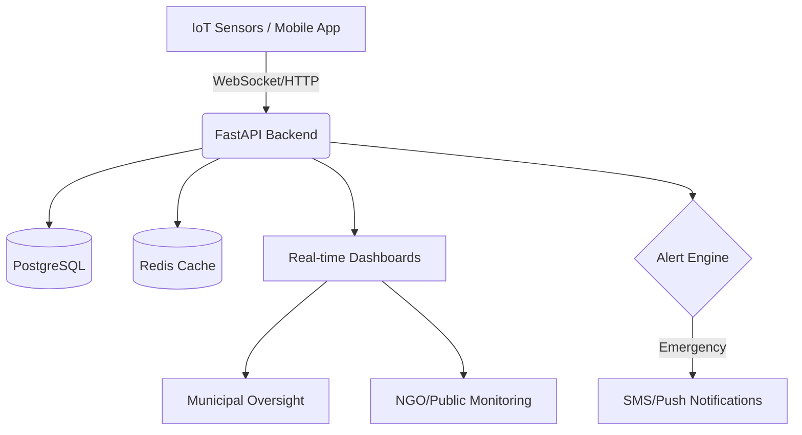

# TRANAM (परित्राणाय साधूनां)
> **AI-Powered Sewer Worker Protection & Real-Time Safety Monitoring Ecosystem**

[](https://fastapi.tiangolo.com/)
[](https://reactjs.org/)
[](https://www.postgresql.org/)
[](https://www.docker.com/)

*"Paritranaya Sadhunam..." (परित्राणाय साधूनां...)*  
*(To protect the righteous...)*

---

## 📖 Overview

**TRANAM** is a state-of-the-art safety platform designed to protect sewer and underground workers using real-time IoT monitoring, AI-driven risk assessment, and automated emergency response protocols. It addresses the critical safety gap in high-risk underground operations by providing a digital safety net for every worker.

### Key Pillars
- **Zero-Tolerance Safety**: Automated check-in/check-out with "Dead Man's Switch" logic.
- **AI Risk Scoring**: Evaluation of environmental factors, depth, and duration to predict hazards.
- **Accountability**: A public registry of contractors with transparent safety scoring.
- **Rapid Response**: Instant escalation to emergency services and stakeholders via SMS/Push notifications.

---

## 🛠 Tech Stack

### Backend
- **Core**: Python 3.11+ / FastAPI (Asynchronous)
- **Database**: PostgreSQL (Via `asyncpg` and `SQLAlchemy`)
- **Caching/Queue**: Redis
- **Auth**: JWT (OAuth2) with salted password hashing

### Frontend
- **Framework**: React 18+ / Vite
- **State Management**: Zustand
- **Styling**: Vanilla CSS (Custom Design System)
- **Icons**: Lucide React

### Infrastructure
- **Containerization**: Docker & Docker Compose
- **Web Server**: Uvicorn (Development) / Gunicorn (Production)

---

## 🏗 System Architecture



---

## 🚀 Getting Started

### Prerequisites
- **Docker Desktop** installed and running.
- **Node.js** (v20+) and **npm**.
- **Python** (v3.11+).

### 1. Database Infrastructure
Start the required PostgreSQL and Redis instances:
```bash
docker-compose up -d
```

### 2. Backend Setup
```bash
cd backend
python -m venv venv
source venv/bin/activate  # On Windows: venv\Scripts\activate
pip install -r requirements.txt
cp .env.example .env      # Configure your environment variables
uvicorn app.main:app --reload --port 8000
```
*API Documentation will be available at [http://localhost:8000/docs](http://localhost:8000/docs).*

### 3. Frontend Setup
```bash
cd frontend
npm install
npm run dev
```
*Application will be available at [http://localhost:5173](http://localhost:5173).*

---

## 🔐 Security & Authentication

- **JWT-based Authentication**: Secure stateless sessions.
- **Role-Based Access Control (RBAC)**: Distinct permissions for Workers, Contractors, Municipalities, and NGOs.
- **Environmental Security**: All sensitive keys must be managed via `.env` files (excluded from git via `.gitignore`).

### Default Credentials (Development)
- **Email**: `admin@safeflow.global`
- **Password**: `admin123`

---

## 📊 Development Guidelines

- **Code Quality**: Follow PEP8 for Python and ESLint for React.
- **Commit Messages**: Follow [Conventional Commits](https://www.conventionalcommits.org/).
- **Testing**: Run backend tests using `pytest` and frontend tests via `vitest`.

---

## 📄 License

This project is licensed under the MIT License - see the [LICENSE](LICENSE) file for details.

---
*Built with ❤️ to protect those who keep our cities running.*
